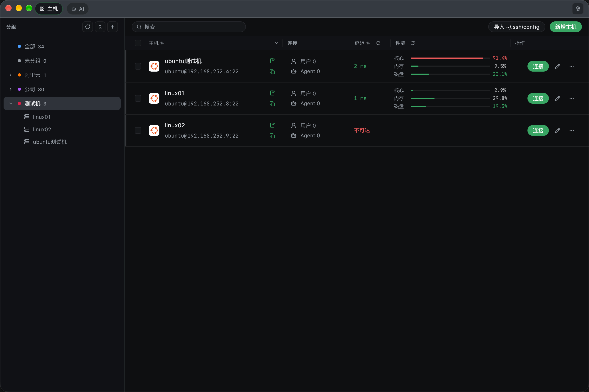
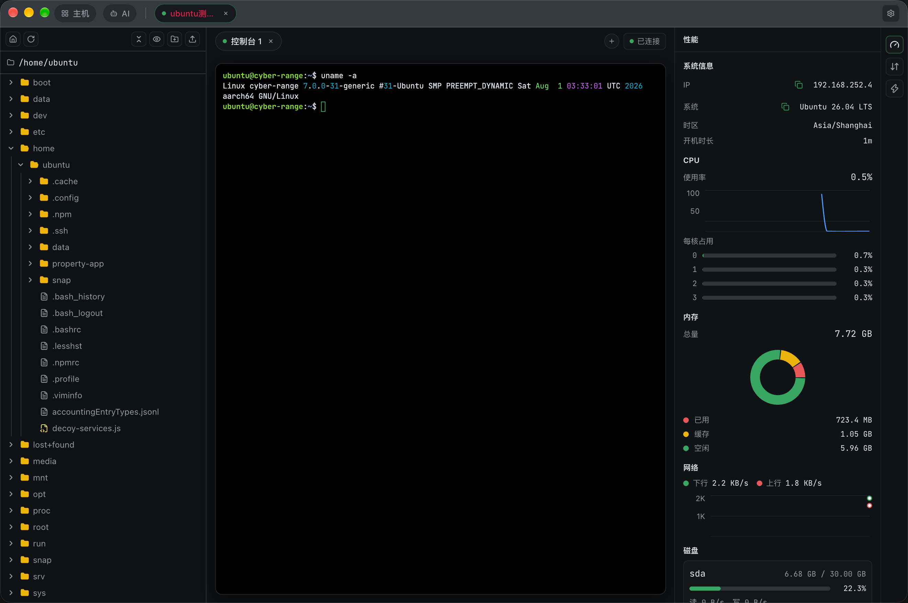
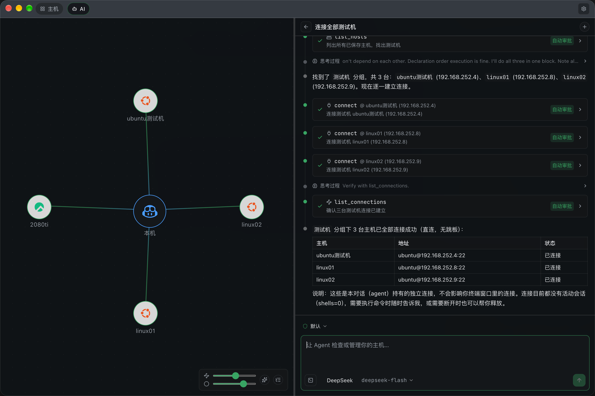
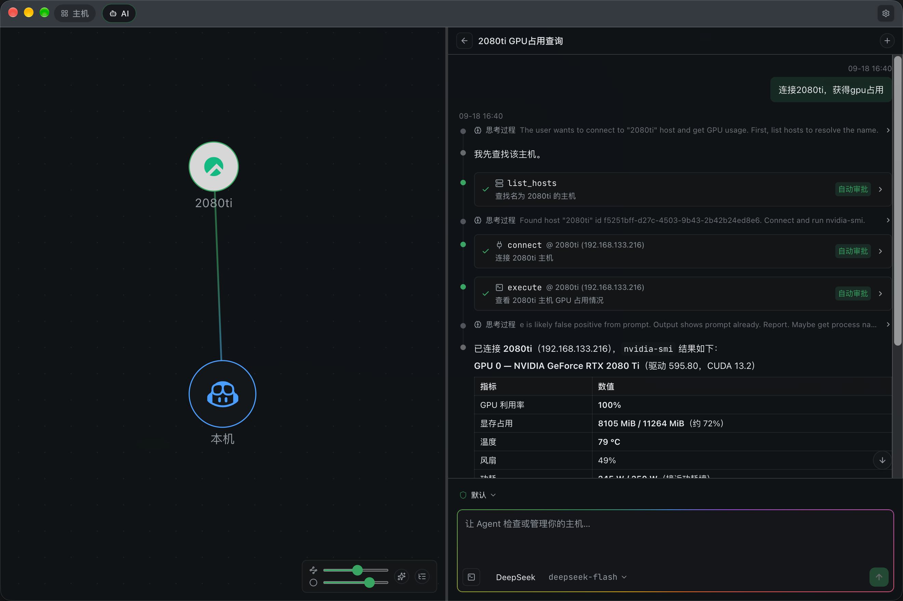

# GGterm

一款结合了 Agent 的跨平台 SSH 桌面客户端。

## 功能特性

- **SSH 终端**：xterm.js、内容搜索、编码自动识别、自动重连
- **主机管理**：主机分组树、连接会话隔离、延迟监测
- **SFTP 文件管理**：上传/下载、进度与速率、tar 打包旁路传输、归档下载
- **远程文件编辑**：内置 Monaco 编辑器
- **AI Agent**：BYOK 接入多厂商模型（OpenAI 兼容接口），Agent 可通过工具操作连接、执行命令、读写文件，命令执行带风险审批门
- **服务器监控**：CPU / 内存 / 网络 / GPU 性能面板、主机拓扑视图
- **国际化**：i18next 中英文
- **审批**：Agent 的敏感操作都会要求人工审批，防止错误操作

## Screenshots









## Project Setup

### Install

```bash
$ npm install
```

### Development

```bash
$ npm run dev
```

### Build

```bash
# For windows
$ npm run build:win

# For macOS
$ npm run build:mac

# For Linux
$ npm run build:linux
```
