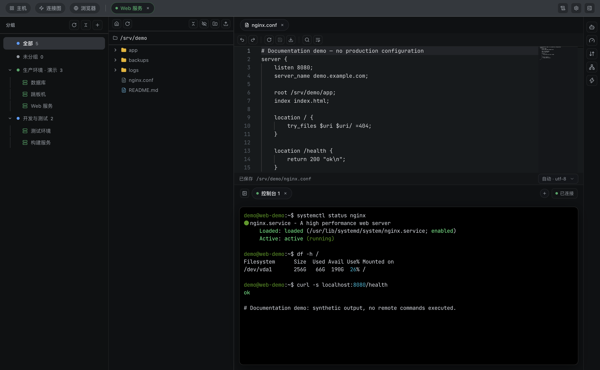
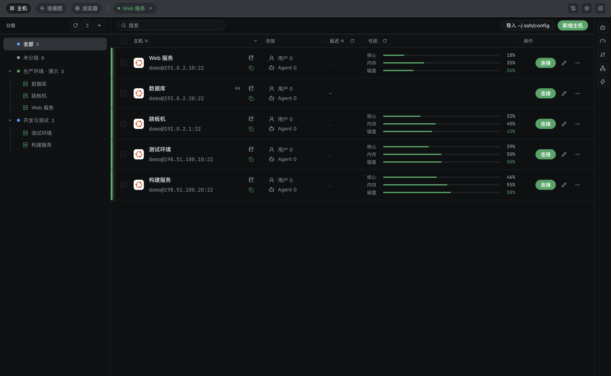
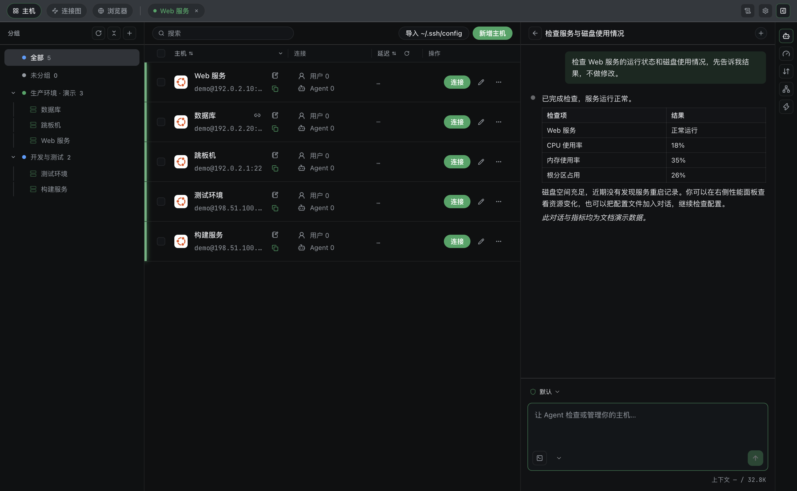
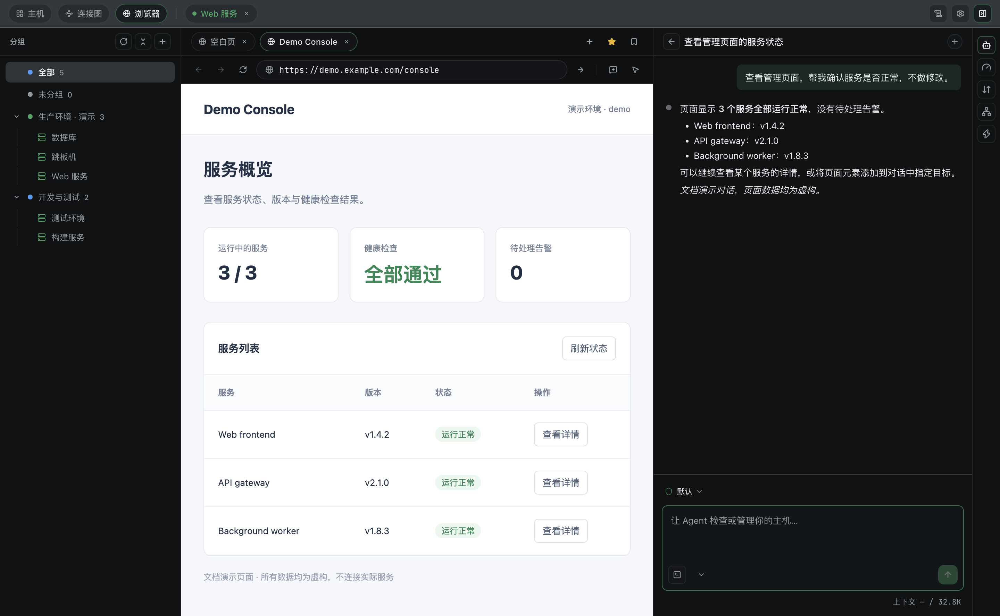
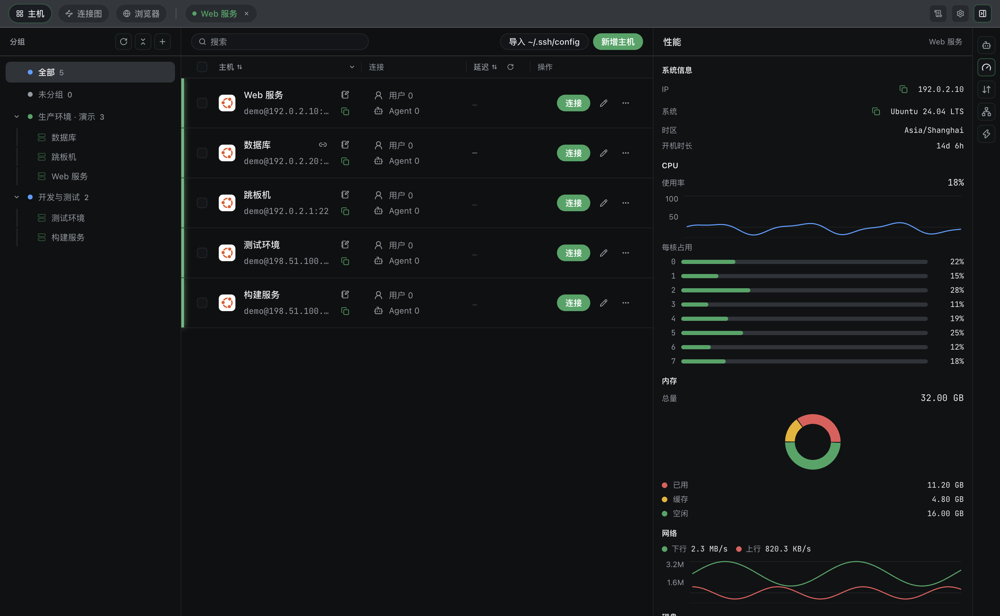

# GGTerm

**把 SSH 终端、文件管理、AI Agent 和浏览器放进同一个工作区。**

GGTerm 是面向服务器运维与开发工作的跨平台桌面客户端。你可以手动连接主机、编辑配置、传输文件，也可以让 Agent 使用工具检查服务、执行命令、处理文件和操作网页，并在同一界面查看执行结果。

支持 macOS、Windows 和 Linux，提供中文与英文界面。AI 采用 BYOK（自带 API Key）方式，通过 OpenAI 兼容接口接入模型。

[下载发布版本](https://github.com/EstamelGG/GGTerm/releases) · [快速开始](#快速开始) · [开发与构建](#开发与构建)



> 本文截图来自真实界面组件，使用隔离的演示数据。主机地址、账号、文件、对话、终端输出和性能指标均为虚构示例，不含真实服务器信息或凭据；截图中的检查结果不代表实际执行记录。

## 功能清单

| 模块          | 已有功能                                                                                         |
| ------------- | ------------------------------------------------------------------------------------------------ |
| 主机管理      | 多级分组、搜索、分组颜色、结构化备注、SSH config 导入、连接测试与延迟探测                        |
| SSH 连接      | 密码与私钥认证、手动输入凭据、多级跳板、保活与自动重连；区分用户和 Agent 的连接会话              |
| 终端工作区    | 多主机与多 Shell 标签页、终端搜索、复制粘贴、编码识别与切换、快捷命令                            |
| SFTP 文件管理 | 目录树、上传下载、新建、重命名、移动、删除、权限修改；传输进度、速率与取消                       |
| 远程编辑      | 内置 Monaco 编辑器，多文件标签页、语法高亮、保存与重新加载、编码处理                             |
| AI Agent      | 多对话、多模型配置、工具调用卡片、操作审批、交互式输入、选项问答、上下文用量与自动压缩           |
| Agent 工具    | 主机与分组管理、SSH 命令、本地与远程文件读写/补丁、文件传输、端口转发、浏览器操作                |
| 内置浏览器    | 多标签页、空白页、书签、前进后退与刷新、网页/DOM 引用加入对话、手动证书放行                      |
| 浏览器自动化  | 后台打开与读取、元素快照、点击/输入/选择/滚动、对话框处理、Playwright 代码执行、敏感信息输入卡片 |
| 性能监控      | 系统信息、CPU 与每核占用、内存、网络速率曲线、磁盘与挂载点、受支持设备的 GPU 信息                |
| 连接与转发    | 连接拓扑视图、本地与远程端口转发、转发状态和连通性探测                                           |
| 工作区与偏好  | 可调整侧栏、传输面板、运行日志、主题强调色、界面缩放、终端字号、中英文切换                       |

## 主机与连接管理

用分组组织不同环境，在列表中查看主机信息、连接情况和性能概览。已有 SSH 配置可以导入，内网主机可以配置跳板链，常用服务信息可以记录在主机备注中。

用户连接与 Agent 连接分别管理。Agent 建立连接后，也可以从工作区查看对应主机的资源，无需为了查看性能再打开一个终端。



## 终端、文件与编辑器

在同一个主机工作区中使用终端、浏览 SFTP 目录和编辑远程文件。多个 Shell 与文件可以分别保留标签页，配置修改和命令验证可以连续完成。

文件传输支持进度、速率和取消，目录下载还提供归档与打包传输相关能力。传输任务可以在统一面板查看。

## 让 Agent 参与实际操作

Agent 可以根据对话调用工具，而不只是返回命令建议：连接主机、检查日志、执行命令、读写配置、下载文件，或在内置浏览器中完成网页操作。

- **提供上下文**：把主机、文件、浏览器标签页或选中的页面元素加入对话。
- **查看执行过程**：工具调用、命令输出和审批请求以卡片呈现；命令会话支持继续读取输出和交互输入。
- **澄清需求**：Agent 可以提出最多三个预设选项，用户也可以选择“其他”自行输入。
- **输入敏感信息**：密码、验证码等可以通过专用输入卡片提交。浏览器输入会直接写入指定字段，工具返回提交状态。
- **管理长对话**：显示上下文用量，支持按模型设置上下文窗口和自动压缩。

例如：

> 检查 Web 服务的运行状态和磁盘使用情况，先告诉我结果，不做修改。
>
> 读取这份配置，解释各项用途，修改前先让我确认。
>
> 打开管理页面，找到对应设备；需要登录时让我输入密码。



## 内置浏览器

在应用内访问 Web 管理后台、文档和开发页面。Agent 能列出已有标签页、复用指定页面，在后台读取内容，也能把页面切换到应用内供用户查看。

浏览器工具支持元素定位、点击、表单输入、复选框、滚动和 JavaScript 对话框；复杂流程可以使用 Playwright 的 `page` 对象。页面读取支持分页，普通操作返回有界的增量反馈，以减少重复网页内容占用上下文。

Agent 操作期间，页面显示控制遮罩，避免用户与 Agent 同时输入。遇到需要处理的证书问题，由用户在界面中审核放行；后台提示采用系统通知，不主动把应用切到前台。



## 性能监控

性能侧栏跟随当前聚焦主机，展示系统信息、CPU、内存、网络和磁盘数据。网络曲线对缺失区间使用虚线连接，不把缺失数据填成零。磁盘信息包含物理磁盘及其分区、挂载点；GPU 数据取决于远端设备与采集工具是否支持。



## 快速开始

1. 从 [Releases](https://github.com/EstamelGG/GGTerm/releases) 获取适合系统的安装包，或按下方步骤从源码运行。
2. 新增主机，填写地址、端口、用户名与认证方式；也可以导入 `~/.ssh/config`。
3. 连接主机，使用终端与 SFTP；需要访问内网主机时配置跳板链。
4. 如需使用 Agent，在设置中添加模型供应商、API 地址与 API Key，并选择对话模型。支持 DeepSeek、通义千问、Ollama 等预设以及自定义 OpenAI 兼容服务，实际工具调用能力取决于模型。
5. 打开 Agent 对话，提供目标主机或文件上下文，并根据需要选择审批策略。

### 数据与权限

连接配置和对话保存在本机。调用远程模型时，相关对话及工具结果会发送到你配置的模型服务；使用前请按数据要求选择服务与模型。

连接凭据和模型密钥优先使用 Electron `safeStorage` 保存。**当前系统加密不可用时会退回 Base64 编码存储，Base64 不属于加密。**

Agent 的操作范围受已配置的连接、本机访问规则与审批策略约束。浏览器证书异常需要用户手动审核。以上机制不代表每个工具操作都会弹出确认，请根据使用环境配置权限。

## 开发与构建

建议使用 **Node.js 22.12 或更新的兼容版本**与 npm。项目包含原生依赖；安装过程可能需要下载 Electron 或使用系统编译工具。

```bash
git clone https://github.com/EstamelGG/GGTerm.git
cd GGTerm
npm ci
npm run dev
```

安装步骤会执行原生依赖准备与项目补丁脚本，请保留安装脚本的执行。

### 检查

```bash
npm run typecheck
npm run lint
npm test

# Electron 集成测试，需要可运行桌面应用的环境
npm run test:browser
npm run test:browser-playwright
npm run test:browser-tls
```

### 构建安装包

在对应平台准备构建环境后运行：

```bash
npm run build:mac
npm run build:win
npm run build:linux
```

macOS 公证、代码签名及各平台发行所需的凭据需要另外配置。

### 技术栈与目录

Electron · React · TypeScript · electron-vite · Zustand · Tailwind CSS · xterm.js · Monaco Editor · SSH2 · AI SDK · Playwright

```text
src/main/          Electron 主进程、SSH/SFTP、Agent 与浏览器
src/preload/       主进程与界面之间的受控接口
src/renderer/      React 页面、组件和状态管理
src/shared/        共用类型与数据约定
tests/             单元测试与 Electron 集成测试
docs/screenshots/  README 演示截图
```
